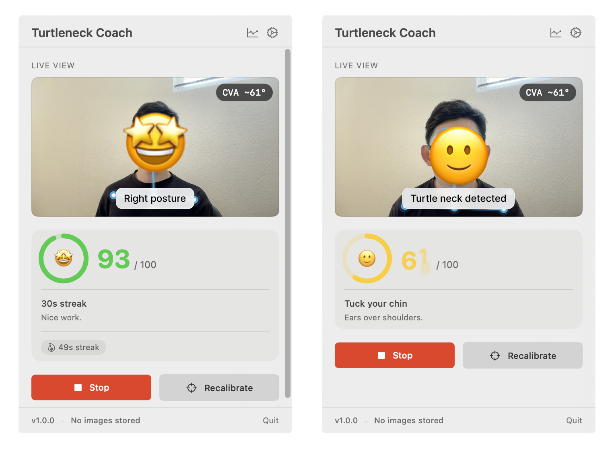
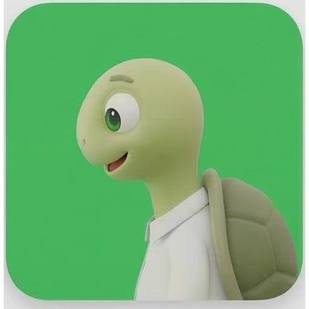
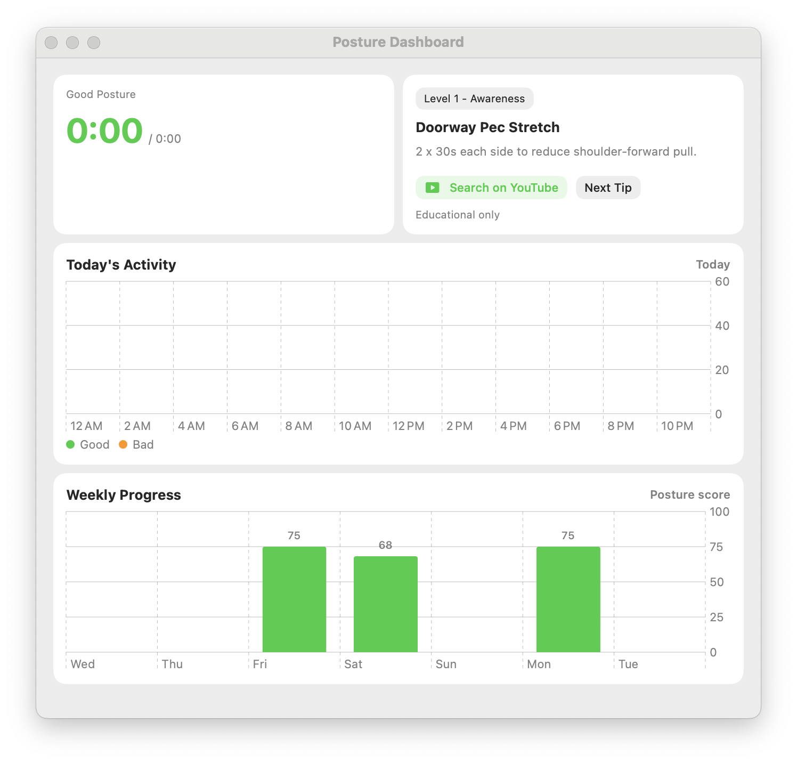

# Turtleneck Coach

  

  A gentle macOS posture coach that lives in your menu bar.

  

  

  Turtleneck Coach is a gentle posture coach for macOS. It lives in your menu bar, adapts to your current setup, and nudges you before forward-head posture turns into a habit.

## Keep The Turtle Green

  

  You do not need to watch posture charts all day. Just keep the turtle green while you work.

## Features

<table>
<tr>
<td width="40%" valign="middle">
<h3>Gentle coaching while you work</h3>
See your current posture state live and get quiet reminders when forward drift lasts too long. Turtleneck Coach stays lightweight so you can leave it running in the background.
</td>
<td width="60%">

</td>
</tr>
<tr>
<td width="40%" valign="middle">
<h3>Recalibrate for your current setup</h3>
Different desk height, camera angle, or seating position? Recalibrate and keep going. The app learns your upright baseline for this setup instead of forcing one fixed posture rule.
</td>
<td width="60%">

</td>
</tr>
<tr>
<td width="40%" valign="middle">
<h3>See progress over time</h3>
Open the dashboard for daily sessions, weekly trends, and coaching tips. The goal is not more warnings. It is better posture habits over time.
</td>
<td width="60%">

</td>
</tr>
</table>

## Built For Everyday Use

- Menu bar first: glanceable posture state without opening a full app window
- Sensitivity modes: Relaxed, Balanced, and Strict
- Battery friendly: pauses when you step away or close your laptop
- Private by default: camera processing stays on-device
- Designed for real desks: recalibrate when your setup changes

## Install

1. Open the [latest release](https://github.com/ilwonyoon/turtleneck-coach/releases/latest).
2. Download the notarized DMG.
3. Drag `TurtleneckCoach.app` into `Applications`.
4. Launch the app from `Applications` and allow camera access.
5. Open the turtle in the menu bar and run calibration once for your current setup.

## Requirements

- macOS 14 Sonoma or later
- Apple Silicon Mac
- Camera access

## Privacy

- Camera processing stays on-device.
- Calibration and session data are stored locally on your Mac.
- Turtleneck Coach is not a medical device.

See the [privacy policy](./docs/privacy-policy.md) and [distribution guide](./docs/DISTRIBUTION.md) for more detail.
