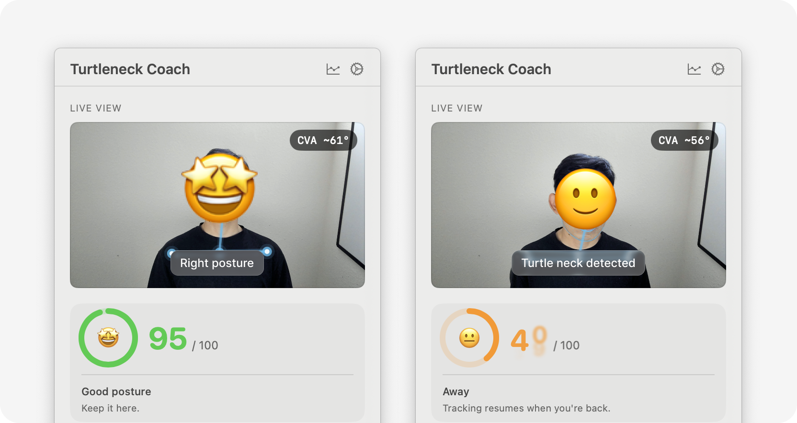
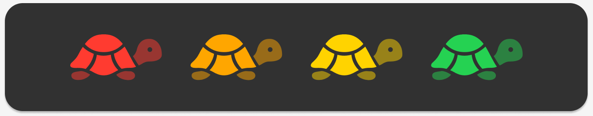
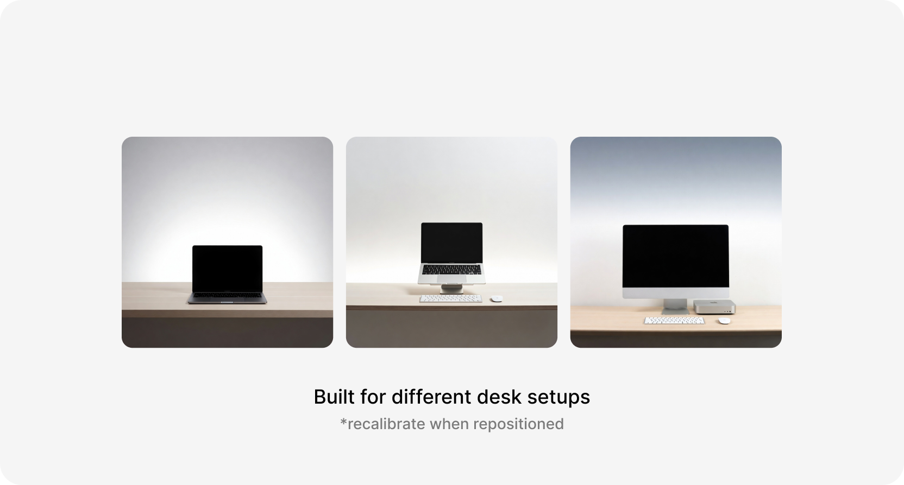
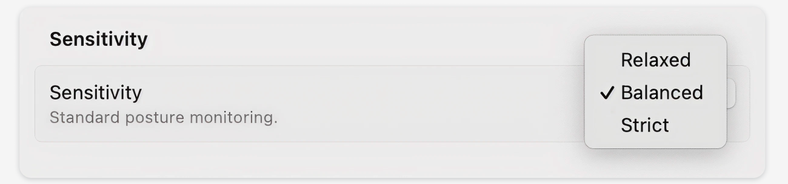
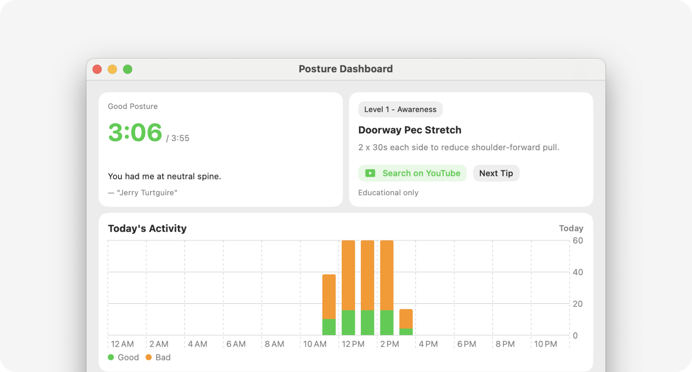

# Turtleneck Coach

  

  A gentle macOS posture coach that lives in your menu bar.

  

  Turtleneck Coach is a gentle posture coach for macOS. It lives in your menu bar, adapts to your current setup, and nudges you before forward-head posture turns into a habit.

## Features

### Gentle coaching while you work

See your current posture state live and get quiet reminders when forward drift lasts too long. Turtleneck Coach stays lightweight so you can leave it running in the background.

  

### Read the signal instantly

The sidebar turtle tells you how you are doing at a glance. Green means keep going. Yellow and orange mean it is time to correct before bad posture becomes your default.

  

### Built for different desk setups

Move between a laptop on the desk, a raised laptop, or a monitor setup without changing how the app works. Recalibrate when your setup moves and keep going.

  

### Choose the sensitivity that fits you

Relaxed, Balanced, or Strict. Pick the coaching style that matches your posture habits and how often you want reminders during the day.

  

### See progress over time

Open the dashboard for daily sessions, weekly trends, and coaching tips. The goal is not more warnings. It is better posture habits over time.

  

## Built For Everyday Use

- Menu bar first: glanceable posture state without opening a full app window
- Battery friendly: pauses when you step away or close your laptop
- Private by default: camera processing stays on-device

## Install

1. Open the [latest release](https://github.com/ilwonyoon/turtleneck-coach/releases/latest).
2. Download the notarized DMG.
3. Drag `TurtleneckCoach.app` into `Applications`.
4. Launch the app from `Applications` and allow camera access.
5. Open the turtle in the menu bar and run calibration once for your current setup.

## Requirements

- macOS 14 Sonoma or later
- Apple Silicon Mac
- Camera access

## Privacy

- Camera processing stays on-device.
- Calibration and session data are stored locally on your Mac.
- Turtleneck Coach is not a medical device.

See the [privacy policy](./docs/privacy-policy.md) and [distribution guide](./docs/DISTRIBUTION.md) for more detail.
